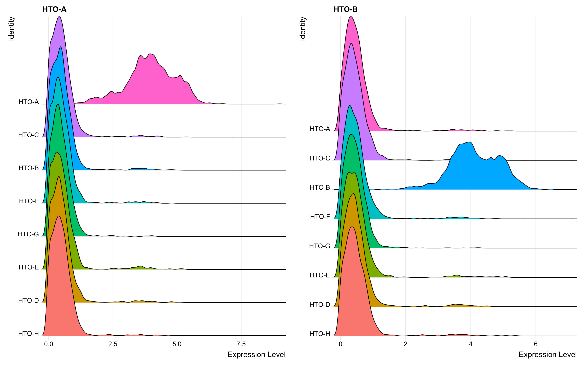
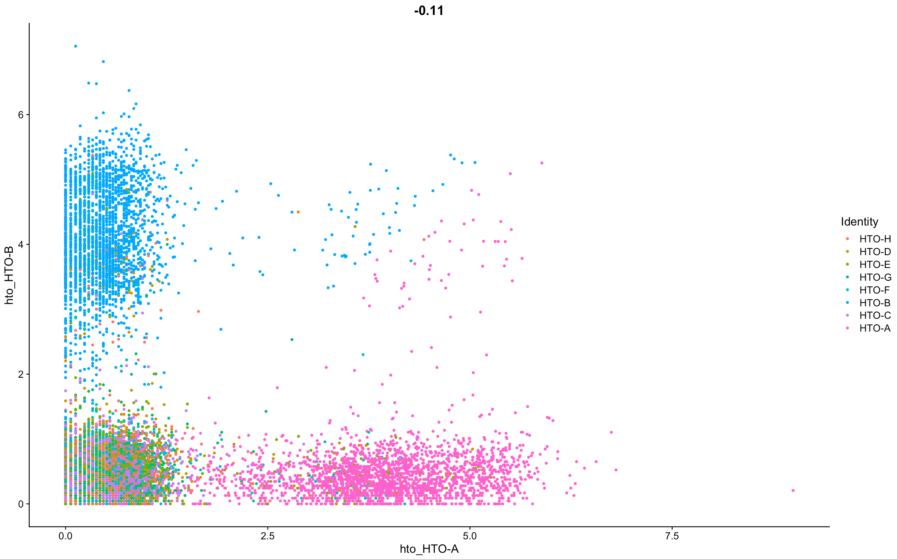

# Demultiplexing of Patient Samples

In this project, I've reanalyzed the data generated from the published paper https://genomebiology.biomedcentral.com/articles/10.1186/s13059-018-1603-1.

The published paper is saved in the 'Paper' folder.    
The Rmd and html scripts are saved in the 'Script' folder.    
The figures generated from the script are saved in the 'Figures' folder.

The authors of this paper introduce a new method for scRNA-seq multiplexing, where cells are labeled with sample-specific oligonucleotide tagged antibodies (HTOs) directed against immune surface markers (CD45, CD98, CD44, and CD11a). These HTOs contain unique 12bp barcode that can be sequenced alongside the cellular transcriptome.

The experiment was designed in a way where CITE-seq and Cell Hashing was performed simultaneously, yet generating separate sequencing libraries. In their proof-of-principle experiments, they obtained peripheral blood mononuclear cells (PBMCs) from eight separate human donors (donors labelled A through H) and each sample was stained with a different HTOs-conjugated antibody. The samples were pooled and run in a single lane on the 10X Genomics Chromium Single Cell 3' v2 system; expecting a yield of 20,000 single cells and generation of transcriptome, HTO, and ADT libraries. The cells were sequenced on the Illumina platform and the demultiplexing step was performed using the Seurat software.

**Highly expressed HTOs**    
Based upon the maximum HTO signal, HTO-A and HTO-B seem to be the most highly expressed.

**Mutual exclusivity of HTO-A and HTO-B**

    

